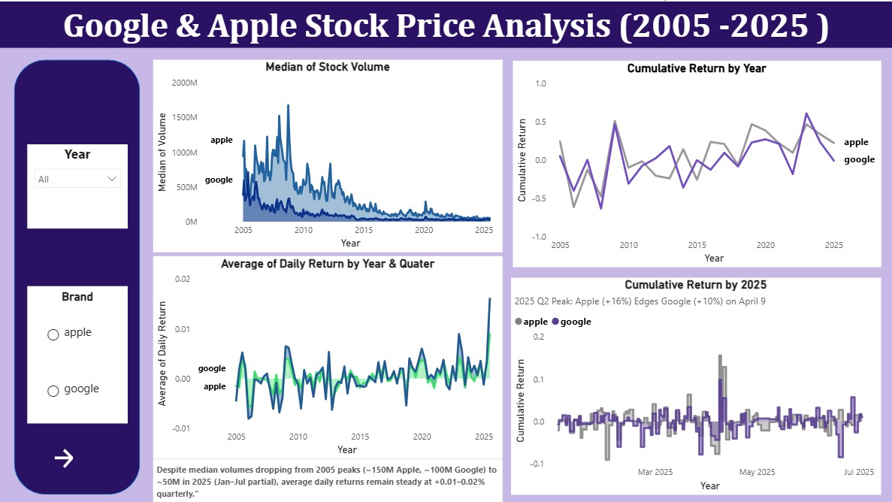
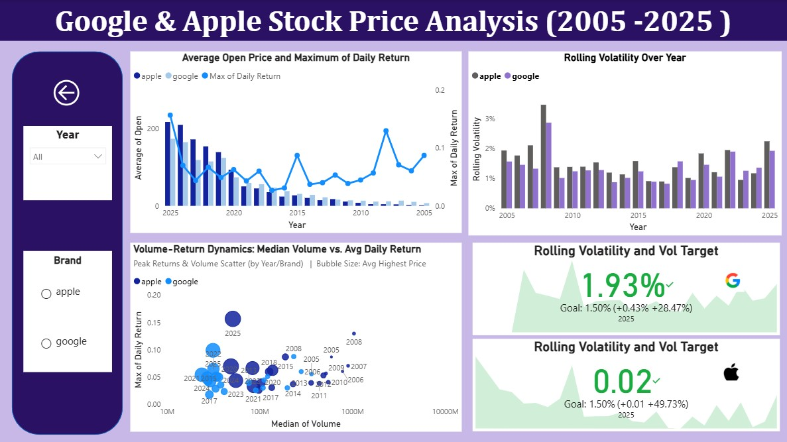
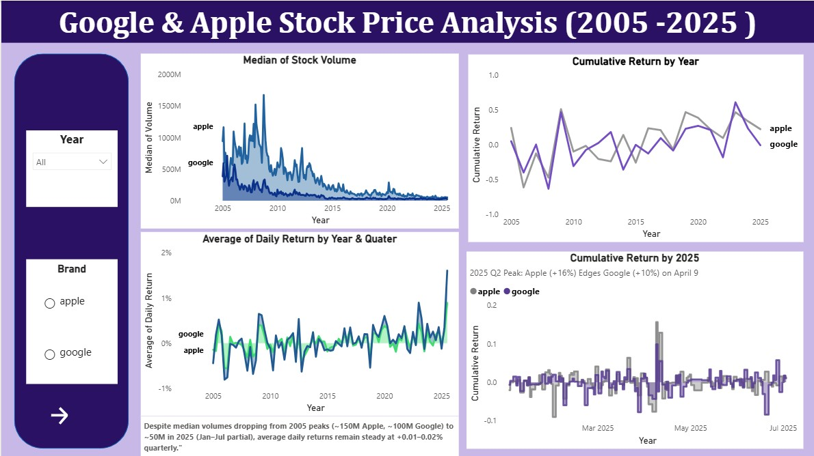
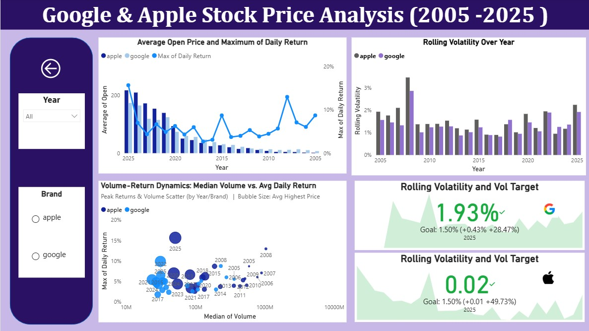

## Dashboard Preview




# 📊 Google & Apple Stock Price Analysis Dashboard (2005–2025)


---

## 📌 Project Overview

This project presents a comparative stock price analysis of **Apple** and **Google** from **2005 to 2025**, focusing on:

- Stock price movements over time  
- Trading volume behavior  
- Daily, cumulative, and rolling returns  
- Volatility and risk during major economic events  

The dashboard enables users to explore **gains, losses, and risk levels on specific dates** using interactive filters and custom DAX measures.

---

## 📂 Dataset

- **Dataset Name**: World Stock Prices (Daily Updating)  
- **Source**: Kaggle  
- **Link**: https://www.kaggle.com/datasets/nelgiriyewithana/world-stock-prices-daily-updating  
- **Original Data Provider**: Yahoo Finance  
- **Frequency**: Daily  
- **Key Fields**: Date, Open, High, Low, Close, Volume, Company, Country  

---

## 🧹 Data Preparation (Power Query)

The raw dataset was cleaned and transformed before analysis:

- **Split Date & Time Columns**  
  - Separated date and time fields to extract the **date only**, enabling Year → Quarter → Month hierarchies.

- **Filtered Relevant Stocks and Region**  
  - Retained records for:
    - Apple (AAPL)
    - Google (GOOGL)
    - Country = United States

- **Removed Zero Volume Records**  
  - Eliminated rows where `Volume = 0` to allow logarithmic volume scaling and accurate volatility calculations.

- **Date Range Filtering**  
  - Limited analysis to **2005–2025**, since Apple does not contain data before 2005.

- **Data Validation**  
  - Ensured correct data types, removed duplicates, and handled minor inconsistencies.

---

## 📐 Calculated Columns

### Daily Return
Percentage price change from open to close within a single trading day:


Daily Return =
DIVIDE([Close] - [Open], [Open])

  - Positive value → Daily gain

  -  Negative value → Daily loss

  - Formatted as a percentage (%)

📊 Key DAX Measures
Cumulative Return

Calculates the overall stock performance up to the selected date:

Cumulative Return =
VAR CurrentDate = MAX('World-Stock-Prices-Dataset'[Date])
RETURN
CALCULATE(
    SUM([Daily Return]),
    FILTER(
        ALL('World-Stock-Prices-Dataset'[Date]),
        'World-Stock-Prices-Dataset'[Date] <= CurrentDate
    )
)

Rolling Volatility
- Computed as the standard deviation of daily returns over a 252-day rolling window (approximately one trading year).

-  Used to measure short-term price risk and market uncertainty.

Rolling volatility indicates how much stock returns fluctuate over time.
Higher values imply higher risk and uncertainty.
Volatility Target (Constant Measure)

Volatility Target = 0.015

- Represents a 1.5% daily volatility benchmark

- Used to compare observed volatility against a low-risk threshold
---
📈 Key Insights (2005–2025)
📉 Trading Volume Trends

   - Trading volumes decreased steadily for both companies:

        Apple: ~150M → ~50M shares

        Google: ~100M → ~30M shares

   - Indicates market maturity and increasing institutional participation.

📊 Daily Returns

  -  Average daily returns remained relatively stable despite declining volumes.

  -  Maximum daily returns (2025 – partial data):

        Apple: +0.16% with ~51,379,600 volume

        Google: +0.10% with ~31,382,750 volume

📈 Cumulative Returns

 -   Q2 2025 recorded the highest cumulative returns:

        Apple: ~+16%

        Google: ~+10%

 -   Reflects strong recovery momentum in the technology sector.

⚠️ Rolling Volatility

 -   2008 exhibited the highest volatility due to the global financial crisis.

 -   2025 volatility levels:

        Apple: ~2.0%

        Google: ~2.1%

    Both remain slightly above the 1.5% volatility target but far below crisis levels.
---
🔍 Comparative Performance

  -  Apple and Google stock prices move largely in tandem, reflecting sector-wide trends.

  -  Apple demonstrates:

        Higher maximum daily returns

        Moderate trading volumes

        Slightly lower volatility in recent years compared to Google

⚠️ Notes & Limitations

  -  2025 data is partial (January–July) and may not represent full-year performance.

  -  High daily returns in 2025 reflect short-term market movements rather than annualized trends.
---
🛠 Tech Stack

 -   Power BI

        Power Query for data transformation

        Interactive visuals and slicers

  -  DAX

        Daily Return

        Cumulative Return

        Rolling Volatility

  -  Data Source

        Kaggle CSV (Yahoo Finance)
---

```dax
