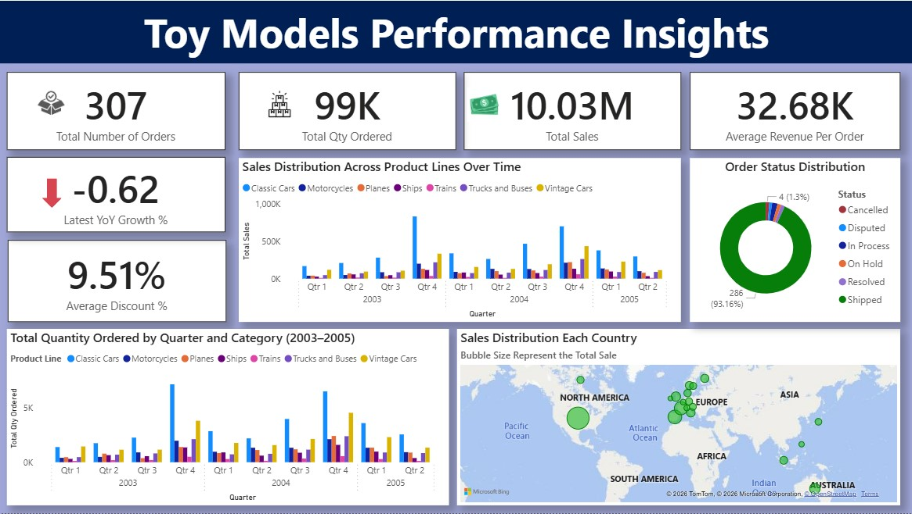
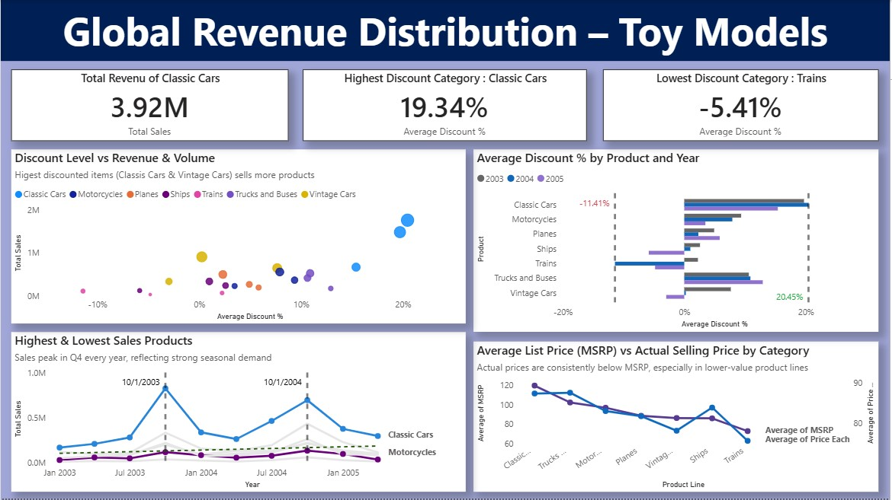
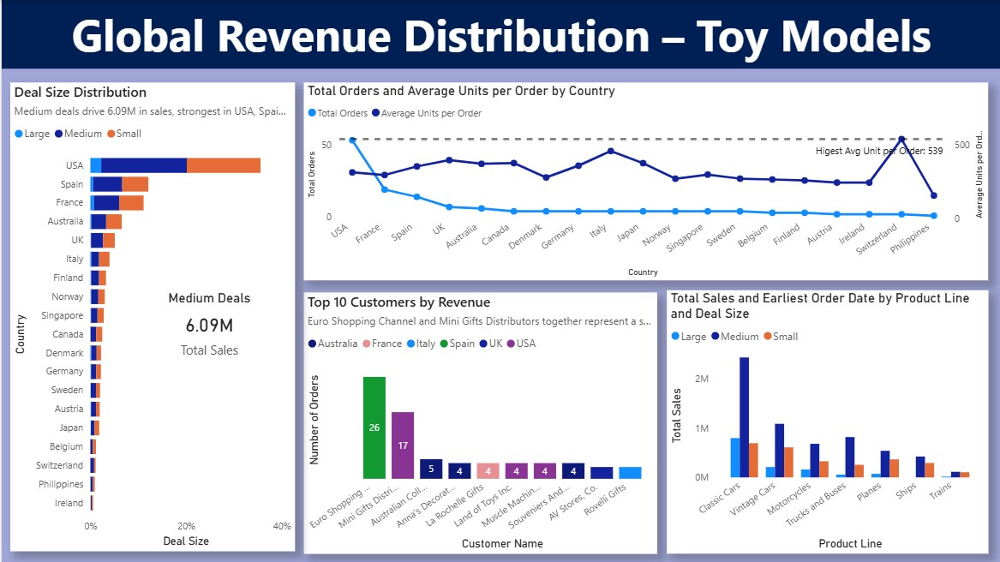
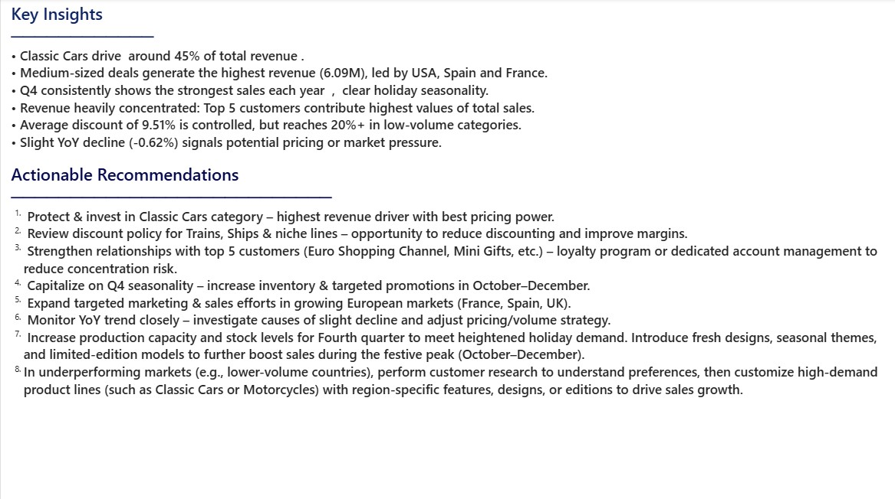

# 📊 Toy Model Performance Analysis Dashboard

## Dashboard Preview
<table>
  <tr>
    <td align="center">
      
      <br><sub>Executive Summary</sub>
    </td>
    <td align="center">
      
      <br><sub>Product & Pricing Deep Dive</sub>
    </td>
  </tr>
  <tr>
    <td align="center">
      
      <br><sub>Customer & Geographic Insights</sub>
    </td>
    <td align="center">
      
      <br><sub>Insights & Recommendations</sub>
    </td>
  </tr>
</table>

---

## 📌 Project Overview
This is a Power BI dashboard I built as part of a technical assignment for a job application.  
It uses the publicly available Classic Models sample dataset (toy/scale model wholesaler) to demonstrate skills in:
- Power Query (data cleaning, transformation, split columns)
- DAX measures (YoY growth, AOV, average discount % with AVERAGEX)
- Data modeling & relationships
- Visual storytelling (KPIs, trends, maps, top-N)
- Interactivity (slicers, drill-through, filters)
- Advanced visual features (trend lines, min/max/constant lines, X/Y constant lines)
- Business insights & recommendations

**Dataset source:** Classic Models sample database (widely used for learning)  
All design decisions, layout, calculations, and commentary are my own.

---

## 📂 Dataset
- **Dataset**: Classic Models (toy/scale model sales)
- **Time Period**: 2003–2005
- **Granularity**: Order-line level (~2,900 rows)
- **Main Fields**: Order No, Qty Ordered, Price Each, MSRP, Sales, Product Line, Country, Deal Size, etc

---

## 🧹 Data Preparation (Power Query & Python)
The raw dataset was cleaned and transformed before analysis:

**Power Query:**
- Split columns where needed (e.g., multi-value fields)
- Standardized formats and data types
- Handled nulls meaningfully (kept State/Territory nulls as they are geography-specific)
- Created date hierarchies (Year → Quarter → Month)

**Python:**
- Renamed all columns for clarity and consistency (e.g.,ORDERNUMBER → Order No. , etc.)
- Minor data validation and preprocessing

---

## 🛠 Tech Stack
- Power BI Desktop
  - Power Query ( data transformation, custom columns)
  - DAX measures
  - Visual storytelling (KPIs, trends, maps, top-N)
  - Interactivity (slicers, filters, drill-through)
- Advanced Visual Features
  - Trend lines, min/max lines, constant lines
  - X/Y constant lines for reference
- Python (column renaming & initial cleaning)

---

## 📐 Key DAX Measures

**Average Discount %**  
```dax
Average Discount % = 
AVERAGEX(
    'sales_data_clean',
    DIVIDE(
        'sales_data_clean'[MSRP] - 'sales_data_clean'[Price Each],
        'sales_data_clean'[MSRP],
        0
    )
)
```
**Average Revenue Per Order (AOV)**
```dax
Average Revenue Per Order = 
DIVIDE([Total Sales], [Total Orders], 0)
```
**Average Units per Order**
```dax
Average Units per Order = 
DIVIDE(
    SUM('sales_data_clean'[Qty Ordered]),
    [Total Orders],
    0
)
```
**Latest YoY Growth %**
```dax
Latest YoY Growth % = 
VAR LatestYear = MAX('sales_data_clean'[Year])
VAR SalesLatest = CALCULATE([Total Sales], 'sales_data_clean'[Year] = LatestYear)
VAR SalesPrev   = CALCULATE([Total Sales], 'sales_data_clean'[Year] = LatestYear - 1)
RETURN
    DIVIDE(SalesLatest - SalesPrev, SalesPrev, 0)
```
**Total Orders**
```dax
Total Orders = DISTINCTCOUNT('sales_data_clean'[Order No.])
```
**Total Sales**
```dax
Total Sales = SUM('sales_data_clean'[Sales])
```
---
## 📈 Key Insights
- Classic Cars drive around 45% of total revenue — core strength of the portfolio.
- Medium-sized deals generate the highest revenue (6.09M), led by USA, Spain, and France.
- Q4 consistently shows the strongest sales each year — clear holiday seasonality.
- Revenue heavily concentrated: Top 5 customers contribute highest values of total sales.
- Average discount of 9.51% is controlled, but reaches 20%+ in low-volume categories.
- Slight YoY decline (-0.62%) signals potential pricing or market pressure.
---
## 🔍 Actionable Recommendations
- Protect & invest in Classic Cars category – highest revenue driver with best pricing power.
- Review discount policy for Trains, Ships & niche lines – opportunity to reduce discounting and improve margins.
- Strengthen relationships with top 5 customers (Euro Shopping Channel, Mini Gifts, etc.) – loyalty program or dedicated account management to reduce concentration risk.
- Capitalize on Q4 seasonality – increase inventory & targeted promotions in October–December.
- Expand targeted marketing & sales efforts in growing European markets (France, Spain, UK).
- Monitor YoY trend closely – investigate causes of slight decline and adjust pricing/volume strategy.
- Increase production capacity & stock levels for Q4 to meet heightened holiday demand. Introduce fresh designs, seasonal themes, and limited-edition models to boost sales during the festive peak (October–December).
- In underperforming markets (e.g., lower-volume countries), perform customer research to understand preferences, then customize high-demand product lines (such as Classic Cars or Motorcycles) with region-specific features, designs, or editions to drive sales growth.
---
  
